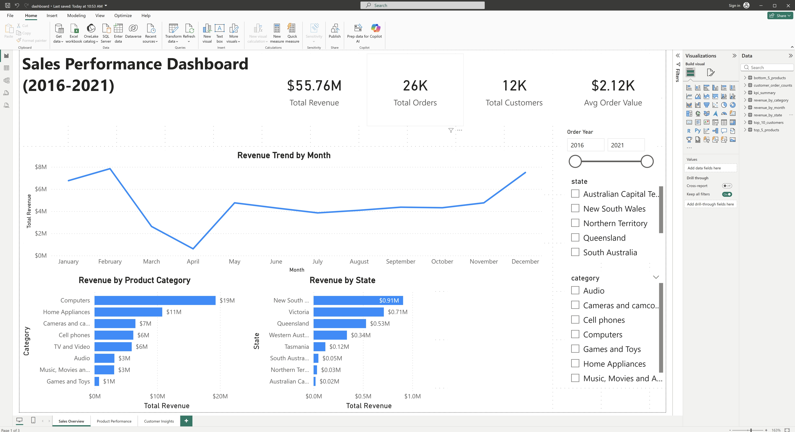

# Global Electronics Sales Analysis

## Project Overview
This project analyzes historical sales data for a global electronics retailer to uncover insights into revenue performance, customer behavior, product trends, and regional sales distribution. SQL was used for data exploration and aggregation, while Power BI was used to build an interactive executive dashboard for decision-making.

The goal of the project is to demonstrate end-to-end analytics skills — from data cleaning and EDA in SQL to business-focused visualization in Power BI.

---

## Dataset
The dataset consists of three main tables:
- **Sales**: Order-level transactions, quantities, dates, and customer/product keys
- **Customers**: Customer demographics and geographic information
- **Products**: Product categories, subcategories, and pricing

---

## Tools & Technologies
- **SQL (MySQL)** – Data cleaning, joins, aggregation, and EDA
- **Power BI** – Interactive dashboard and visual analytics
- **GitHub** – Version control and project documentation

---

## Key Business Questions Answered
- What is the total revenue, total orders, total customers, and average order value?
- How does revenue trend over time?
- Which product categories and products generate the most revenue?
- Which products are underperforming?
- Which customers contribute the highest revenue?
- How does revenue vary across states?

---

## Dashboard Overview

### 1. Sales Overview

Provides a high-level view of business performance, including:
- Total Revenue
- Total Orders
- Total Customers
- Average Order Value
- Monthly revenue trend
- Revenue by category and state

---

### 2. Product Performance

Highlights:
- Top 5 products by revenue
- Bottom 5 products by revenue  
Used to identify revenue concentration and underperforming products.

---

### 3. Customer Insights

Focuses on:
- Top 10 customers by total revenue  
Demonstrates customer revenue concentration and high-value accounts.

---

## Key Insights
- Revenue is concentrated among a small number of top products and customers.
- Certain product categories consistently outperform others in revenue contribution.
- Sales show clear seasonal patterns with revenue peaks in specific periods.
- A small subset of customers generates a disproportionate share of total revenue.

